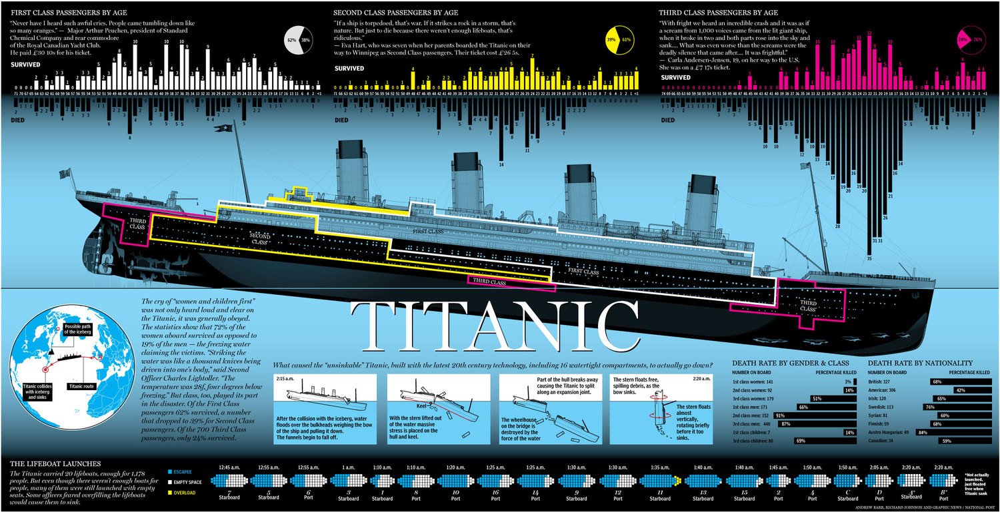

# Titanic思路

总共有如下的潜在自变量：PassengerId, Pclass, Name, Sex, Age, SibSp, Parch, Ticket, Fare, Cabin, Embarked

因变量：Survived

任务是建立从自变量到因变量的模型，用来预测test data

流程为：数据处理+特征工程，模型选择与训练，预测结果

## 数据处理+特征工程

这个流程的大体思路是对数据进行清洗，统计并处理重复值、缺失值等，并且进行特征提取，将特征转化成数值

首先可以去除的自变量是PassengerId，因为具体身份号码和是否死亡不可能有关系。

查询Titanic沉船的过程，首先是船尾沉没，然后是中间断开，最后是船首沉没。因此Pclass这一个与位置相关的自变量极为关键。



名字和是否死亡不可能有关系，但是名字中的尊称可以看出一个人的性别和大致年龄，因此需要提取新增一列并转化成数字。

```python
train_test_data = [train, test] # combining train and test dataset
for dataset in train_test_data:
    dataset['Title'] = dataset['Name'].str.extract(' ([A-Za-z]+)\.', expand=False)
title_mapping = {"Mr": 0, "Miss": 1, "Mrs": 2,
                 "Master": 3, "Dr": 3, "Rev": 3, "Col": 3, "Major": 3, "Mlle": 3,"Countess": 3,
                 "Ms": 3, "Lady": 3, "Jonkheer": 3, "Don": 3, "Dona" : 3, "Mme": 3,"Capt": 3,"Sir": 3 }
for dataset in train_test_data:
    dataset['Title'] = dataset['Title'].map(title_mapping)
train.drop('Name', axis=1, inplace=True)
test.drop('Name', axis=1, inplace=True)
```

性别肯定有关系，因此转换成数字

```python
sex_mapping = {"male": 0, "female": 1}
for dataset in train_test_data:
    dataset['Sex'] = dataset['Sex'].map(sex_mapping)
```

年龄需要处理的是缺失值，将其选为尊称相同的人年龄的中位数

```python
train["Age"].fillna(train.groupby("Title")["Age"].transform("median"), inplace=True)
test["Age"].fillna(test.groupby("Title")["Age"].transform("median"), inplace=True)
```

再进一步将不同范围的年龄编号

```python
for dataset in train_test_data:
    dataset.loc[dataset['Age'] <= 16, 'Age'] = 0
    dataset.loc[(dataset['Age'] > 16) & (dataset['Age'] <= 26), 'Age'] = 1
    dataset.loc[(dataset['Age'] > 26) & (dataset['Age'] <= 36), 'Age'] = 2
    dataset.loc[(dataset['Age'] > 36) & (dataset['Age'] <= 62), 'Age'] = 3
    dataset.loc[dataset['Age'] > 62, 'Age'] = 4
```

出发地总共有三种，将其编号并替换原有数据，并且将出发地为空的数据填充为0

```python
for dataset in train_test_data:
    dataset['Embarked'] = dataset['Embarked'].fillna('S')
embarked_mapping = {"S": 0, "C": 1, "Q": 2}
for dataset in train_test_data:
    dataset['Embarked'] = dataset['Embarked'].map(embarked_mapping)
```

船费中的空值填充为处于同一等级舱的所有人船费的中位数，然后再将船费进行分箱

```python
train["Fare"].fillna(train.groupby("Pclass")["Fare"].transform("median"), inplace=True)
test["Fare"].fillna(test.groupby("Pclass")["Fare"].transform("median"), inplace=True)
for dataset in train_test_data:
    dataset.loc[dataset['Fare'] <= 17, 'Fare'] = 0
    dataset.loc[(dataset['Fare'] > 17) & (dataset['Fare'] <= 30), 'Fare'] = 1
    dataset.loc[(dataset['Fare'] > 30) & (dataset['Fare'] <= 100), 'Fare'] = 2
    dataset.loc[dataset['Fare'] > 100, 'Fare'] = 3
```

SibSp, Parch都是家庭成员，因此新建一列为家庭总人数，且去除SibSp和Parch两列。并将家庭总人数映射至0-4区间。

```python
train["FamilySize"] = train["SibSp"] + train["Parch"] + 1
test["FamilySize"] = test["SibSp"] + test["Parch"] + 1
family_mapping = {1: 0, 2: 0.4, 3: 0.8, 4: 1.2, 5: 1.6, 6: 2, 7: 2.4, 8: 2.8, 9: 3.2, 10: 3.6, 11: 4}
for dataset in train_test_data:
    dataset['FamilySize'] = dataset['FamilySize'].map(family_mapping)
```

Cabin编号，并将缺省值替代为同一Pclass的Cabin值的中位数。

```python
for dataset in train_test_data:
    dataset['Cabin'] = dataset['Cabin'].str[:1]
cabin_mapping = {"A": 0, "B": 0.4, "C": 0.8, "D": 1.2, "E": 1.6, "F": 2, "G": 2.4, "T": 2.8}
for dataset in train_test_data:
    dataset['Cabin'] = dataset['Cabin'].map(cabin_mapping)
train["Cabin"].fillna(train.groupby("Pclass")["Cabin"].transform("median"), inplace=True)
test["Cabin"].fillna(test.groupby("Pclass")["Cabin"].transform("median"), inplace=True)
```

至此我们处理了自变量中的Pclass, Name, Sex, Age, SibSp, Parch, Fare, Cabin, Embarked，而PassengerId和Ticket与存活与否没有直接关系，因此去除

最终得到如下的自变量数据

|      | Pclass | Sex  | Age  | Fare | Cabin | Embarked | Title | FamilySize |
| ---- | ------ | ---- | ---- | ---- | ----- | -------- | ----- | ---------- |
| 0    | 3      | 0    | 1.0  | 0.0  | 2.0   | 0        | 0     | 0.4        |
| 1    | 1      | 1    | 3.0  | 2.0  | 0.8   | 1        | 2     | 0.4        |
| 2    | 3      | 1    | 1.0  | 0.0  | 2.0   | 0        | 1     | 0.0        |
| 3    | 3      | 1    | 2.0  | 2.0  | 0.8   | 0        | 2     | 0.4        |

## 模型选择与训练

因为上述数据为离散，最后结果也为离散，则选取K临近算法、决策树、随机森林、朴素贝叶斯、支持向量机进行模型拟合

```python
k_fold = KFold(n_splits=10, shuffle=True, random_state=0)

clf = KNeighborsClassifier(n_neighbors = 13)
scoring = 'accuracy'
score = cross_val_score(clf, train_data, target, cv=k_fold, n_jobs=1, scoring=scoring)
# cross_val_score第一个参数是选择的模型，第二个参数是训练数据，第三个参数是结果，第四个参数的意思是将整个数据分成十份，用九份进行训练，用一份进行测试算准确率。总共进行十次，将这十次的准确率平均作为最终准确率。
print(round(np.mean(score)*100,2))

clf = DecisionTreeClassifier()
scoring = 'accuracy'
score = cross_val_score(clf, train_data, target, cv=k_fold, n_jobs=1, scoring=scoring)
print(round(np.mean(score)*100,2))


clf = RandomForestClassifier(n_estimators=13)
scoring = 'accuracy'
score = cross_val_score(clf, train_data, target, cv=k_fold, n_jobs=1, scoring=scoring)
print(round(np.mean(score)*100,2))


clf = GaussianNB()
scoring = 'accuracy'
score = cross_val_score(clf, train_data, target, cv=k_fold, n_jobs=1, scoring=scoring)
print(round(np.mean(score)*100,2))


clf = SVC()
scoring = 'accuracy'
score = cross_val_score(clf, train_data, target, cv=k_fold, n_jobs=1, scoring=scoring)
print(round(np.mean(score)*100,2))

# 最终得到的上述四个模型的分数为79.58, 81.37, 78.78, 83.5, 因此选择支持向量机模型进行预测

clf = SVC()
clf.fit(train_data, target)
test_data = test.drop("PassengerId", axis=1).copy()
prediction = clf.predict(test_data)
submission = pd.DataFrame({
        "PassengerId": test["PassengerId"],
        "Survived": prediction
    })
submission.to_csv('submission.csv', index=False)

```

提交submission.csv文件至Kaggle，完成比赛。
